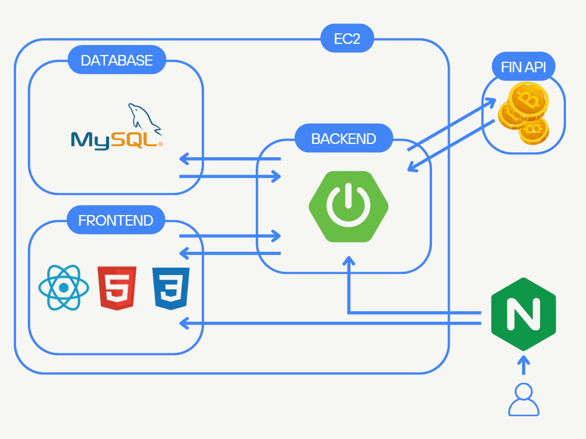
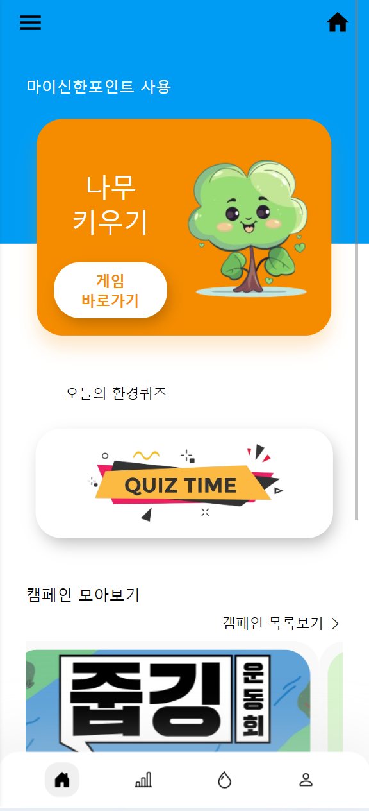
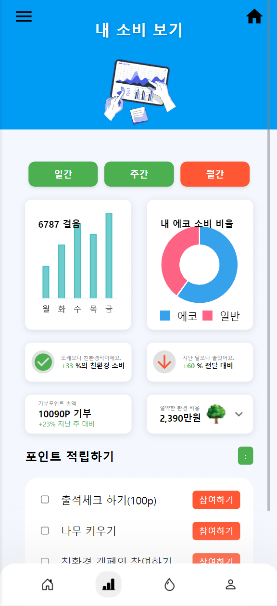
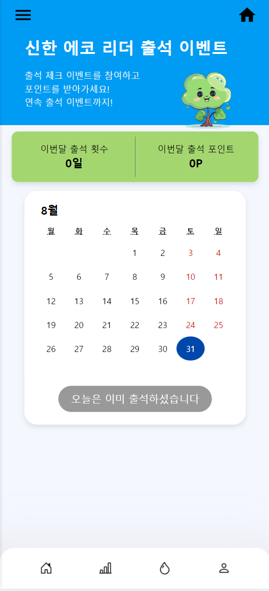
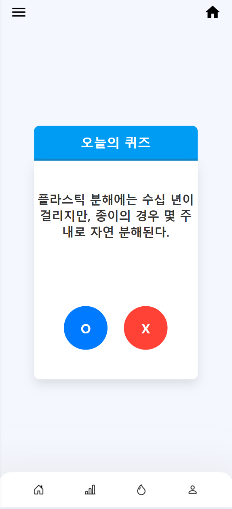
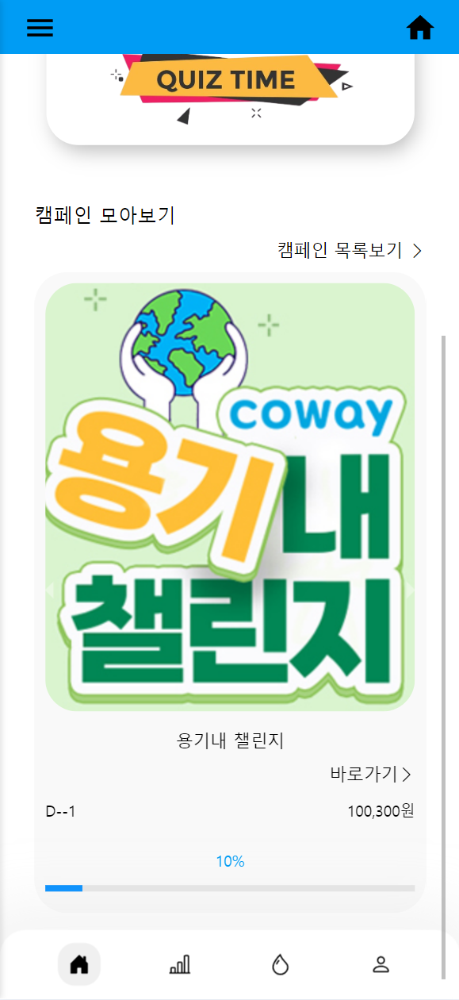
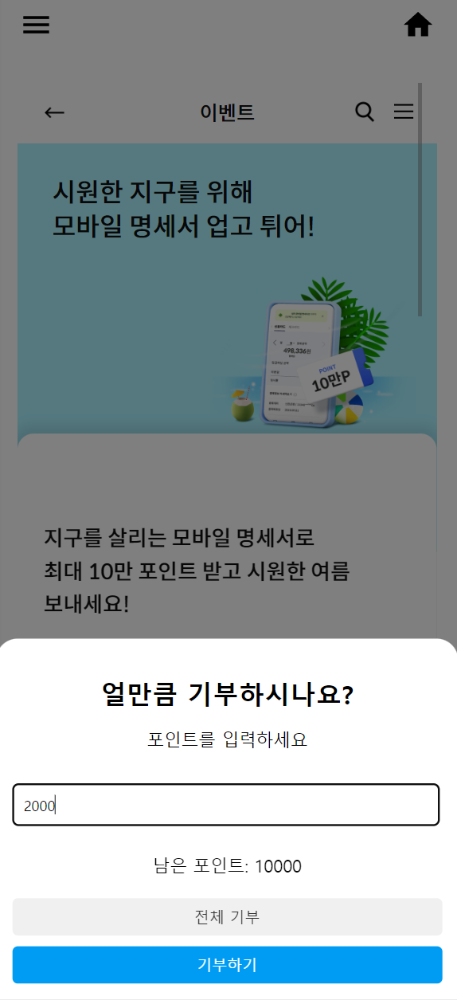
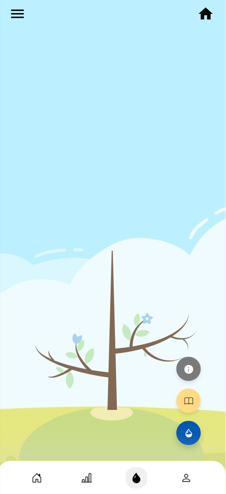
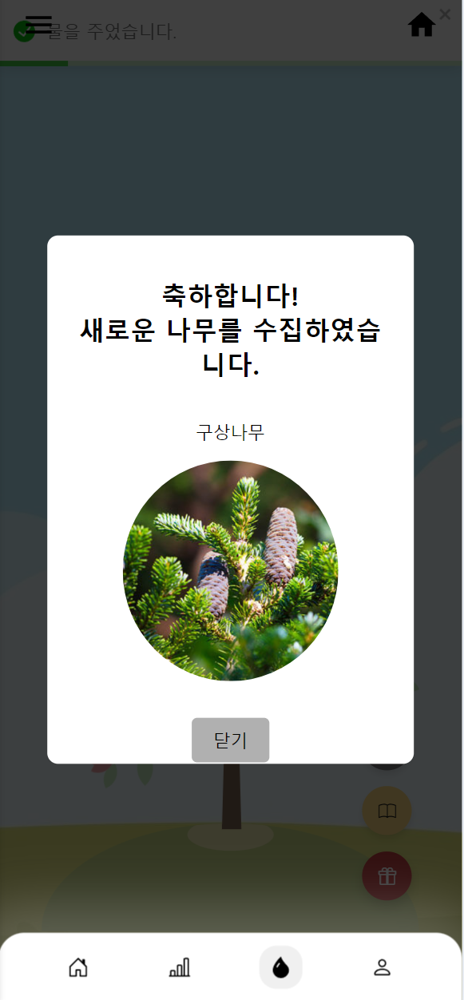

# SEL (Shinhan-Eco-Leading)

### SHINHAN HACKATHON WITH SSAFY

팀명 : F1ve Guys  
기간 : 2024.08.14(금) ~ 2024.09.01(일)  
주제 : 언제 어디서나 고객의 일상에 스며드는 **Everywhere Bank**

## 팀원 소개
| 　**[이수완](https://github.com/Rafael-Lee-SW)👑**　 | **[강성구](https://github.com/strong-nine)** |  **[박상용](https://github.com/sangypar)**   | **[이동엽](https://github.com/doongyeop)** | **[정해준](https://github.com/jun-23)** |
| :--------------: | :--------: | :-----------: | :--------: | :--------: |
|  **FRONT&PM**  | **BACK**  | **FRONT** | **BACK**  |  **FULL&INFRA**  |

## 목차
### 1. [프로젝트 개요](#프로젝트-개요)
- [기획배경](#기획배경)
- [기대효과](#기대효과)
### 2. [프로젝트 설계](#프로젝트-설계)  
- [ERD](#erd)
- [서비스 아키텍쳐](#서비스-아키텍쳐)
### 3. [기술 스택](#기술-스택)    
### 4. [화면 구성](#화면-구성)    
### 5. [핵심 기능](#핵심-기능)    
### 6. [프로젝트 회고](#프로젝트-회고)  

## 프로젝트 개요
### 기획배경
 - 최근 이상 기후로 인해 많은 소비자들이 기후 변화의 심각성을 실감하고 있으며, 이에 따라 **ESG활동에 대한 관심이 높아지고 있습니다.** 
 - 많은 사람들이 큰 비용이 들지 않는다면 기꺼이 ESG 활동을 실천할 의향을 가지고 있으며, 특히 친환경 활동을 통해 만족감을 느끼고 있습니다. (**신한은행, 2024 보통사람 금융생활 보고서**)
 - 비록 ESG의 실천 주체로 주로 기업이 인식되고 실제로도 많은 기업들이 이를 실행하고 있지만, 저희 서비스는 **일반 소비자들도 ESG 활동에 적극적으로 동참할 수 있는 기회**를 제공하고자 합니다. 
 ### 기대효과
 - 이로 인해 소비자들은 단순히 소비를 넘어서 **환경과 사회에 긍정적인 영향을 미치는 데 기여한다는 보람**을 느낄 수 있습니다.
 - ESG활동에 관심이 많은 **계좌 미보유 고객의 유입**을 기대할 수 있습니다.
 - 체류시간 증가로 인해 **서비스 이용도가 높아짐**을 기대할 수 있습니다.

## 프로젝트 설계
### ERD

 

### 서비스 아키텍쳐

### [Convention](https://github.com/sel-f1veguys/sel-f1veguys/wiki/Convention)

## 기술 스택

#### 개발 환경

#### 프론트엔드

 
##### 백엔드

#### 배포

#### 협업 툴 

## 화면 구성  
**메인화면**
  

**소비분석(포인트 획득1)**
   

**포인트 획득2**

**포인트 획득3**
  

**포인트 소비1**

  

**포인트 소비2**

  

## 핵심 기능  
1. 금융API를 활용한 소비분석
2. 소비분석을 통한 마이 신한 포인트적립 : 친환경 기업에서 카드를 사용하면 판별 후 포인트 적립
3. 캠페인 / 나무키우기 등 포인트 소비처 : 캠페인을 통해 ESG활동에 참여할 수 있고 나무키우기를 통해 리워드를 획득할 수 있음.
4. 퀴즈/게임 : 퀴즈와 게이미피케이션을 도입하여 사용자의 체류 시간 증가와 리워드(마이신한포인트) 제공.

## 프로젝트 회고
> **수완👑** : 이번 해커톤에서 팀장으로서 많은 것을 배울 수 있었던 소중한 경험이었습니다. 짧은 시간 안에 목표를 설정하고, 팀원들과 효율적으로 소통하며 프로젝트를 완수하는 과정에서 다소 어려움이 있었지만, 그만큼 보람도 컸습니다. 특히 팀원들의 열정과 협업 덕분에 무수면 코딩 스프린트에서 끝까지 포기하지 않고 목표를 달성할 수 있었습니다. 이번 경험을 통해 팀워크의 중요성을 다시 한번 깨달았고, 앞으로도 이런 도전을 즐기면서 더 성장해 나가고 싶습니다. 

> **성구🧀** : 지난 2주간 바쁘게 달려왔던 신한 해커톤은 처음 해보는 것이었지만 여러모로 좋은 경험이었습니다. 기획을 하고, 다시 수정을 하고, 다시 계획을 수립하기를 여러 차례 반복하기도 하고 목표를 위해 일부 기능에 집중하는 등 성공적으로 프로젝트를 마무리하기 위해 노력하였습니다. 다음에도 이런 좋은 기회가 있으면 좋겠습니다

> **상용🍕** : 처음에는 단기간에 잠도 자지 않은 상태에서 코딩을 할 수 있는지 불안했지만 다 같이 함께하는 분위기 덕분에 이겨낼 수 있었습니다. 디자인을 진행하는 과정에서 가고 있는 방향이 맞는 것인지 헷갈림과 피곤이 합쳐져서 힘든 시간이었지만 팀내의 반복적인 피드백과 멘토링에서 얻을 수 있었던 조언 덕분에 흔들리지 않고 마지막까지 해낼 수 있었습니다. 길게도 느꼈지만 짧았던 저를 성장시킬 수 있었던 소중한 시간이었습니다.

> **동엽🧸** : 이번 해커톤에서 마음이 잘 맞는 팀원들과 함께 좋은 기회를 얻어 본선에 진출할 수 있어 매우 기뻤습니다. 비록 2주라는 짧은 기간 동안 기능을 설계하고 구현하는 과정이 다소 촉박했지만, 팀원들과 함께 재미있게 임해서 정말 즐거운 시간이었습니다. 처음 참여한 해커톤이었음에도 불구하고, 많은 것을 배울 수 있었고 오래도록 기억에 남을 것 같습니다. 좋은 기회를 마련해 주신 신한은행에 감사드립니다!

> **해준🩳** :  해커톤을 통해 단기간에 집중하고 팀원과 상의하면서 개발을 하는 과정에서 급할 때야말로 의사소통 하나하나가 중요함을 느낄 수 있는 좋은 경험이었습니다. 개발하는 동안에는 힘들다라는 생각뿐이었지만 결과물을 만들고 나서야 개발자로써 한 단계 성장함을 느낄 수 있었습니다. 또 자신들도 힘든 상황에서도 문제가 발생했을 때 다 같이 뛰어들어서 해결하는 팀원의 모습에서 더욱 더 돈독해질 수 있는 기회였습니다.

 